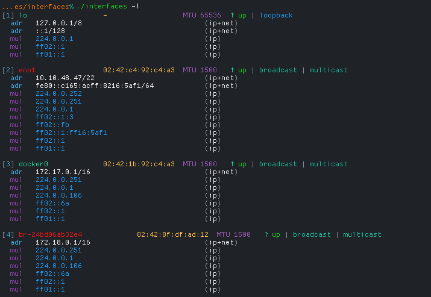

# Interfaces

  

Display a highlighted list of all network interfaces and adresses, using the Go standard library.

Interfaces respects the `NO_COLOR` environment variable and will disable colors if it is set to `1`.

## Installation

Install the latest release tag, using `go install`. Requires Go 1.17 or later:

    go install github.com/xyproto/interfaces@latest

## Screenshot

(MAC addresses are modified)

## General info

* License: BSD-3
* Version: 1.3.0
* Author: Alexander F. Rødseth &lt;xyproto@archlinux.org&gt;
